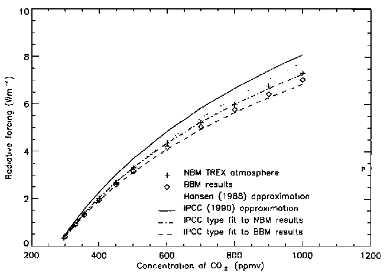

Critique of *The Moral Case for Fossil Fuels* by Alex Epstein
=============================================================

I tried to read this book when it was recommended by a friend. Reviews on Amazon 
were glowing and so I had high expectations. Unfortunately, I was unable to get 
beyond the first chapter. Rather than being informative, I found it to be 
uncritical promotion of fossil fuels.

While I will not go into any depth as to my issues with this book, I will say 
one thing. The basic premise is that humanity has tremendously benefited from 
cheap energy from fossil fuels. I have no argument with that as it is obviously 
true.  But the benefit came from the availability of cheap energy. The fact that 
it was fossil fuels that provided the benefits was largely incidental to the 
benefit.  Had we achieved the cheap energy using solar, wind, or nuclear, the 
benefit would have been the same. However, there are down sides to fossil fuels; 
significant down sides. As such, it is important that we constantly examine our 
energy choices and move towards better alternatives with fewer down sides.  
I worry that this book acts to discourage the search for better alternatives.

There is however one more point I will make as it seems to call into question 
the credibility of the book and as far as I can tell has gone otherwise 
unnoticed.  After giving up on Chapter 1 I skipped ahead to the chapter on 
global warming and ran into a section where the author clearly misleads the 
reader.

Misleading Section on Greenhouse Effect
---------------------------------------

In chapter 4 the author claims that "the greenhouse effect of CO₂ is an *extreme 
diminishing effect*".  Here is the text:

    As the following illustration shows, the greenhouse effect of CO₂
    is an *extreme diminishing effect* — a *logarithmically* decreasing effect.
    This is how the function looks when measured in a laboratory.

    Notice that we are just before 400 ppm (which means CO₂ is 0.04 percent of 
    the atmosphere), where the effect really starts tapering off; the warming 
    effect of each new molecule is not much.

    This means that the initial parts per million of CO₂ do the vast majority of 
    the warming of our atmosphere.  The image below shows how, all things being 
    equal, the heating effect of each additional increment of CO₂ is smaller and 
    smaller.

    .. figure:: decelerating-greenhouse-effect.jpeg
        :width: 100%
        :align: center

        Figure 4.1: The Decelerating, Logarithmic Greenhouse Effect

As the source of this data Epstein cites the following :ref:`paper by Myhre 
<radiative-forcing-of-greenhouse-gasses.pdf`::

    New estimates of radiative forcing due to well mixed greenhouse gasses.
    Gunnar Myhre
    *Geophysical Research Letters*, vol 25, no 14, pp. 2715-2718, July 15, 1998

That paper discusses several greenhouse gasses, but it gives the following 
figure as the primary result for CO₂:

    Figure 1: Radiative forcing as a function of concentration of CO₂.

As you can see, these two figures differ.  In addition, a careful reading of 
Myhre's paper uncovers no mention of the greenhouse effect of CO₂ being an 
"extreme diminishing effect".  What you will find is a mathematical model for 
the greenhouse effect of CO₂ given in Table 3.  It is::

    ΔF = α ln(C/C₀)
    where
        α = 5.35 (or 6.3)
        C₀ = 280 (unstated, but can be extracted from the graph)

There is no evidence that this is a physical model. Indeed it has the look of 
a fitted model. This implies that it has no predictive value and should not be 
used outside of the measured range (280 — 1000 PPM).  In fact, it has 
a non-physical singularity at C = 0 where it predicts infinite cooling.
This should not be taken as an issue with Myhre's model.  It is very common to 
create fitted models as it often more convenient to evaluate a simple formula 
rather than look up and interpolate values from a table.  However it is 
important to never use such models outside their valid range because the results 
are often nonsensical.

Myhre presents this as an incremental model, ΔF is the change in the radiative 
forcing given the increase in CO₂ over pre-industrial levels.
Epstein mistakenly interprets the model as one suitable for absolute rather than 
incremental value. He then extends the model outside its range to the point were 
it becomes singular (C = 0), ignores the singularity, and then draws conclusions 
not supported by the original data.  This is a very serious abuse of the model 
that suggests Epstein does not understand the model, or even modeling in 
general.  As such, his conclusion is spurious and must be ignored.

It is not surprising the Epstein misinterpreted the model. One cannot be an 
expert in every field. It is surprising that he did not appear to confirm his 
conclusion with those that are knowledgeable in the field.  Certainly a quick 
conversation with Myhre himself would have resolved the issue. The fact that 
Epstein did not attempt to confirm his novel and rather surprising conclusion 
leads credence to the idea that this his book is intended to promote 
a particular world view rather than to inform.
